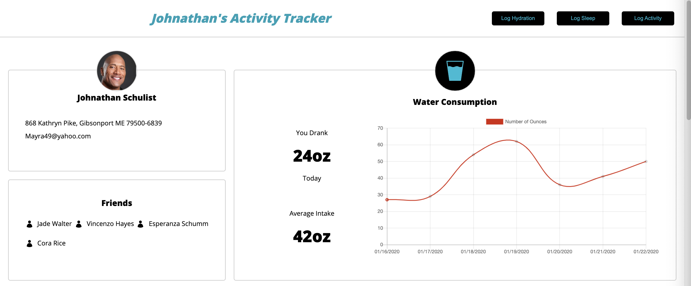
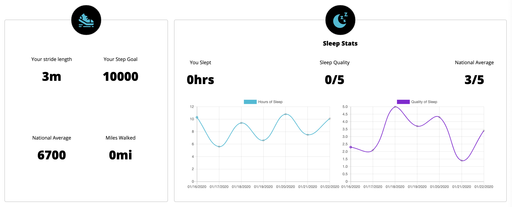
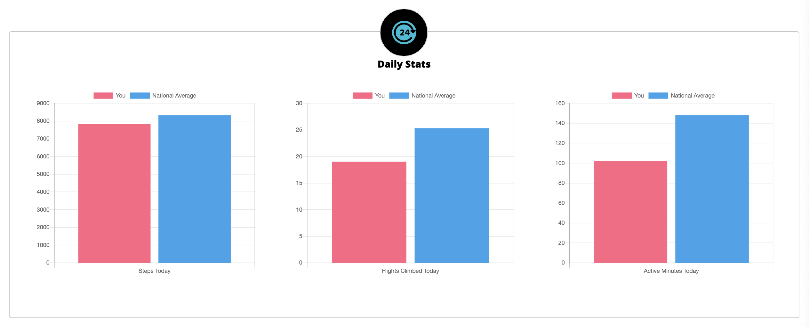
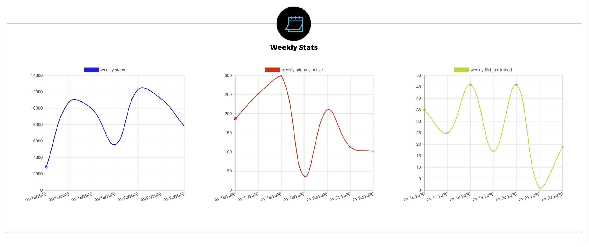
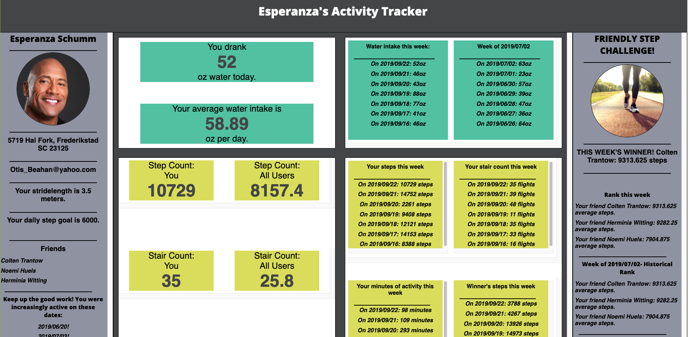
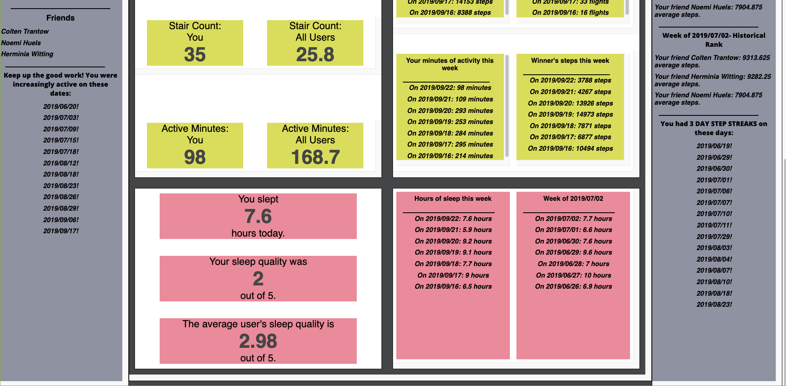
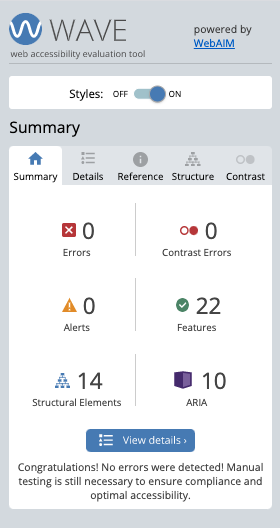
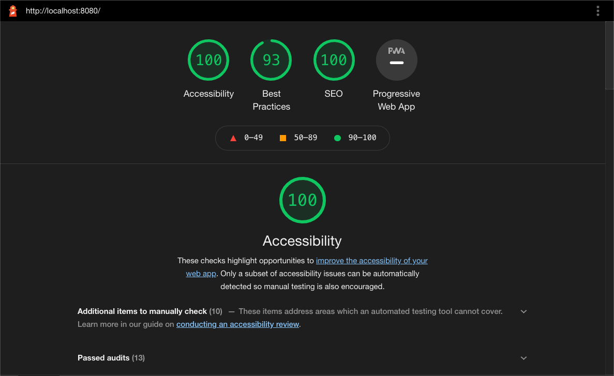

<h1 align="left">Refactor Tractor</h1>

  

## Table of Contents

- [About the Project](#about-the-project)
  - [Final Product](#final-product)
  - [Project Before](#project-before)
- [Project Goals](#project-goals)
- [Installation](#installation)
- [Technologies Used](#technologies-used)
- [Functionality](#functionality)
  - [General](#general)
  - [Error Handling](#error-handling)
  - [Mobile View](#mobile-view)
  - [Tablet View](#tablet-view)
  - [Accessibility](#accessibility)
- [Contributors](#contributors)
- [Contact](#contact)

## About the Project

In this project, our job was to take code that was written by another student and transform it into a beautiful, functional application. 

#### Final Product:

#### Project Before:

## Project Goals 
1. Make network requests to API endpoints to retrieve and manipulate data.
2. Refactor pre-existing code and use inheritance to DRY up repetitive logic.
3. Ensure our app is following best accessibility practices.
4. Leverage Sass to DRY up CSS.
5. Incorporate Webpack to streamline your workflow process.
6. Make our app responsive so that content can be viewed on all devices.

## Installation
View the site -> 
https://itsnameissteven.github.io/Refactor-Tractor-Fitlit/

Or clone the repo to your local machine and launch the index.html file in your browser.

View code at -> 
https://github.com/itsnameissteven/Refactor-Tractor-Fitlit 

## Technologies Used

- 

- 

- 

- 

- 

- 

## Functionality

#### General
Activity Tracker is a versatile web application that enables its users to track their fitness goals and accomplishments, water consumption, and sleep stats. 

Not only can users view their own data, but they can compare their stats with other Activity Tracker users on the national level. This national user data comes from incorporating data from an API. 

Enabling the user to add their data to the API and see the charts and graphs automatically update before their eyes with current information was our top priority. Users can add information by clicking on a log button and entering their stats.

#### Error Handling
Error handling was considered when building the forms. The user cannot proceed unless all of the required fields are filled in. Numbers and decimals are only permitted in input fields. Smooth transitions between the form view and the widget view ensure an enjoyable UI. 

#### Responsive
##### Mobile View

##### Tablet View

#### Accessibility
Activity Tracker scores very highly on Wave and received a 100% from Lighthouse on Accessibility.. Users can tab throughout the full application, making it accessible for those using keyboards to navigate through. 

## Contributers
* [Alex Thompson](https://github.com/alexthompson207)
* [Anneke Miers](https://github.com/aemiers)
* [Steven Mancine](https://github.com/itsnameissteven)

## Contact

[][linkedin]
[][github]

[][linkedin2]
[][github2]

[][linkedin3]
[][github3]

<!-- Personal Definitions  -->

[linkedin]: https://www.linkedin.com/in/alex-thompson-he-him/
[github]: https://github.com/alexthompson207
[linkedin2]: https://www.linkedin.com/in/anneke-miers/
[github2]: https://github.com/aemiers
[linkedin3]: https://www.linkedin.com/in/steven-mancine-13509521/
[github3]: https://github.com/itsnameissteven
